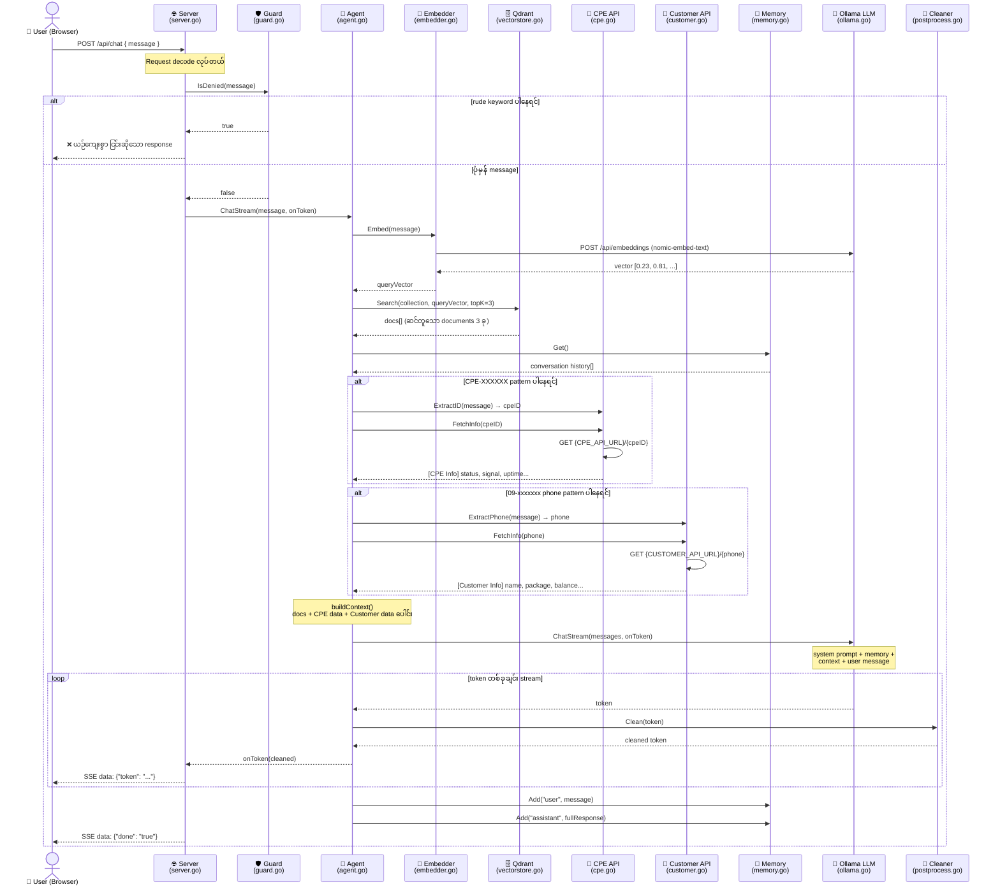

# 🔄 Frontiir AI Chat — Sequence Diagram

> **မြန်မာဘာသာ** — Project Flow Reference
> Full chat request lifecycle from Browser to LLM and back.

---

## 📊 Sequence Diagram

---

## 📝 တစ်ဆင့်ချင်း ရှင်းလင်းချက် (မြန်မာဘာသာ)

### 1️⃣ User → Server

Browser မှ `POST /api/chat` ကို JSON body နဲ့ ပေးပို့တယ်

---

### 2️⃣ Guard စစ်ဆေးမှု

`keywords.json` ထဲက blocked words တွေနဲ့ compare လုပ်တယ်

- ပါရင် → LLM ကို မပေးဘဲ ချက်ချင်း ငြင်းတယ်
- မပါရင် → ဆက်သွားတယ်

---

### 3️⃣ Embed + Search

Message ကို vector ပြောင်းပြီး Qdrant မှာ ဆင်တူတဲ့ knowledge base docs ၃ ခု ရှာတယ်

---

### 4️⃣ Tool Checks

| Detect | Tool | Data |
|---|---|---|
| `CPE-XXXXXX` | CPE API | signal, status, uptime |
| `09-xxxxxxx` | Customer API | name, package, balance |

---

### 5️⃣ Context Build

RAG docs + CPE data + Customer data ကို ပေါင်းပြီး LLM ကို context အဖြစ် ပေးတယ်

---

### 6️⃣ Stream

LLM က token တစ်ခုချင်း ထုတ်ပေးတဲ့အချိန် → Cleaner မှာ မြန်မာ text fix → Browser ကို SSE နဲ့ real-time ပို့တယ်

---

### 7️⃣ Memory Save

Conversation ကို memory ထဲ သိမ်းတယ် (နောက် message မှာ context သိအောင်)

---

*Last updated: 2026-03-04 | Frontiir AI Project*
